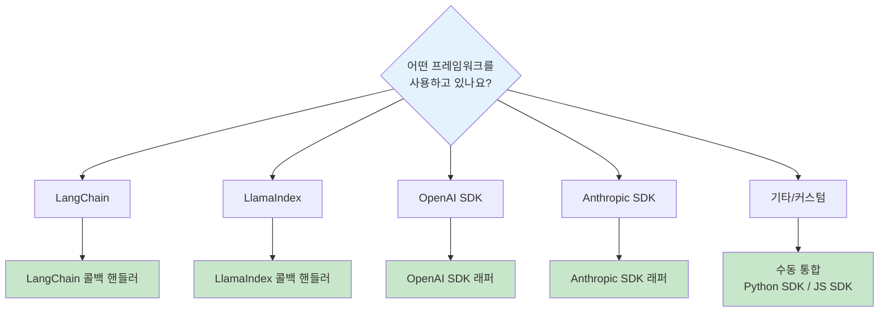

# 프레임워크 통합 가이드

Langfuse는 다양한 LLM 프레임워크 및 SDK와 원활하게 통합됩니다.

## 지원 통합

| 프레임워크 | 언어 | 통합 방식 | 문서 |
|-----------|------|----------|------|
| **OpenAI** | Python, JS | SDK 래퍼 | [가이드](./openai) |
| **LangChain** | Python, JS | 콜백 핸들러 | [가이드](./langchain) |
| **LlamaIndex** | Python | 콜백 핸들러 | [가이드](./llamaindex) |
| **Anthropic** | Python, JS | SDK 래퍼 | [가이드](./anthropic) |

## 통합 방식

### 1. 자동 통합 (추천)

SDK 래퍼나 콜백을 사용하여 코드 변경 최소화:

```python
# OpenAI 자동 통합 예시
from langfuse.openai import openai

# 기존 OpenAI 코드와 동일하게 사용
response = openai.chat.completions.create(
    model="gpt-4",
    messages=[{"role": "user", "content": "Hello"}]
)
# 자동으로 Langfuse에 기록됨
```

### 2. 수동 통합

직접 트레이스와 스팬을 관리:

```python
from langfuse import Langfuse

langfuse = Langfuse()

trace = langfuse.trace(name="my-trace")
generation = trace.generation(
    name="llm-call",
    model="gpt-4",
    input=[{"role": "user", "content": "Hello"}]
)

# LLM 호출
response = call_any_llm("Hello")

generation.end(output=response)
```

## 통합 선택 가이드



## 환경 변수 설정

모든 통합에서 공통으로 사용되는 환경 변수:

```bash
# 필수
LANGFUSE_PUBLIC_KEY=pk-lf-...
LANGFUSE_SECRET_KEY=sk-lf-...

# 선택 (기본값: https://cloud.langfuse.com)
LANGFUSE_HOST=https://cloud.langfuse.com

# 디버그 모드
LANGFUSE_DEBUG=true
```

## 통합 상세 가이드

- [OpenAI 통합](./openai) - OpenAI SDK 자동 래핑
- [LangChain 통합](./langchain) - LangChain 콜백 핸들러
- [LlamaIndex 통합](./llamaindex) - LlamaIndex 통합
- [Anthropic 통합](./anthropic) - Anthropic Claude API
