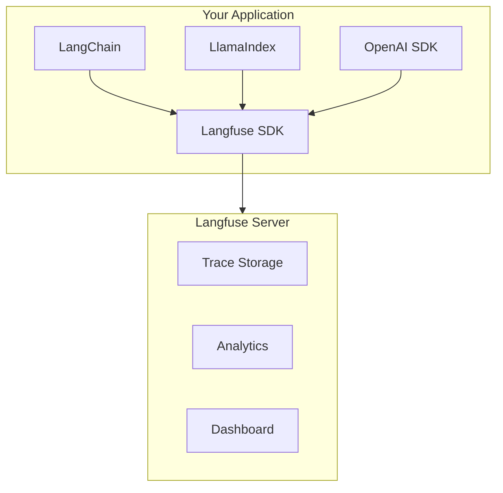

# Langfuse 시작하기

## Langfuse란?

**Langfuse**는 LLM(Large Language Model) 애플리케이션을 위한 오픈소스 관측성(Observability) 및 분석 플랫폼입니다. LLM 기반 애플리케이션의 개발, 모니터링, 디버깅을 위한 종합적인 도구를 제공합니다.

## 주요 기능

### 1. 트레이싱 (Tracing)
- LLM 호출의 전체 실행 흐름을 추적
- 중첩된 스팬(Span)을 통한 상세한 실행 단계 분석
- 입력/출력 데이터 기록 및 분석

### 2. 프롬프트 관리 (Prompt Management)
- 버전 관리가 가능한 프롬프트 저장소
- 프롬프트 A/B 테스팅
- 프로덕션 환경에서 프롬프트 수정 및 배포

### 3. 평가 (Evaluation)
- LLM 출력 품질 평가
- 사용자 피드백 수집
- 자동화된 평가 파이프라인

### 4. 분석 및 메트릭
- 비용 추적 및 분석
- 지연 시간 모니터링
- 토큰 사용량 분석
- 사용자별/세션별 분석

### 5. 데이터셋 및 실험
- 테스트 데이터셋 관리
- 실험 실행 및 비교
- 모델 성능 벤치마킹

## 왜 Langfuse를 사용해야 하나요?

| 기능 | 설명 |
|------|------|
| **오픈소스** | 전체 코드가 공개되어 있으며 셀프 호스팅 가능 |
| **프레임워크 독립적** | LangChain, LlamaIndex, OpenAI SDK 등 다양한 프레임워크 지원 |
| **실시간 모니터링** | 프로덕션 환경의 LLM 호출을 실시간으로 모니터링 |
| **비용 최적화** | 토큰 사용량과 비용을 추적하여 최적화 가능 |
| **팀 협업** | 여러 팀원이 함께 프롬프트와 평가를 관리 |

## 아키텍처 개요

## 다음 단계

- [설치 가이드](./installation) - Langfuse 설치 방법
- [SDK 사용법](./sdk/overview) - Python/JavaScript SDK 사용법
- [통합 가이드](./integrations/overview) - LangChain, LlamaIndex 등과의 통합
- [대시보드 사용법](./dashboard) - 웹 대시보드 기능 안내
