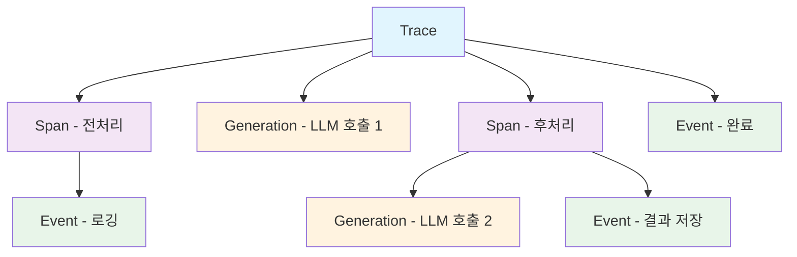

# Langfuse SDK 개요

Langfuse SDK는 애플리케이션에서 LLM 호출을 추적하고 분석하기 위한 도구입니다.

## 지원 언어

| 언어 | 패키지 | 버전 |
|------|--------|------|
| Python | `langfuse` | [](https://pypi.org/project/langfuse/) |
| JavaScript/TypeScript | `langfuse` | [](https://www.npmjs.com/package/langfuse) |

## 핵심 개념

### Trace (트레이스)

**Trace**는 하나의 요청 또는 작업 단위를 나타냅니다. 예를 들어, 사용자가 챗봇에 메시지를 보내면 해당 요청 처리 전체가 하나의 Trace가 됩니다.

```python
from langfuse import Langfuse

langfuse = Langfuse()

# 트레이스 생성
trace = langfuse.trace(
    name="chat-completion",
    user_id="user-123",
    session_id="session-456",
    metadata={"source": "web-app"},
    tags=["production", "v1"]
)
```

### Span (스팬)

**Span**은 Trace 내의 개별 작업 단계를 나타냅니다. 여러 Span을 중첩하여 실행 흐름을 상세히 기록할 수 있습니다.

```python
# 스팬 생성
span = trace.span(
    name="preprocessing",
    input={"text": "사용자 입력"},
    metadata={"step": 1}
)

# 작업 수행...

# 스팬 종료
span.end(output={"processed_text": "처리된 텍스트"})
```

### Generation (제너레이션)

**Generation**은 LLM 호출을 나타내는 특별한 유형의 Span입니다. 토큰 사용량, 비용, 모델 정보 등을 자동으로 추적합니다.

```python
# LLM 호출 기록
generation = trace.generation(
    name="openai-completion",
    model="gpt-4",
    model_parameters={"temperature": 0.7, "max_tokens": 1000},
    input=[{"role": "user", "content": "안녕하세요"}],
)

# LLM 응답 후
generation.end(
    output={"role": "assistant", "content": "안녕하세요! 무엇을 도와드릴까요?"},
    usage={
        "prompt_tokens": 10,
        "completion_tokens": 15,
        "total_tokens": 25
    }
)
```

### Event (이벤트)

**Event**는 특정 시점의 이벤트를 기록합니다 (예: 사용자 클릭, 에러 발생 등).

```python
# 이벤트 기록
trace.event(
    name="user-feedback",
    input={"rating": 5, "comment": "좋은 답변이에요!"}
)
```

## 계층 구조



## 데이터 전송

### 자동 전송

SDK는 데이터를 비동기적으로 배치 처리하여 Langfuse 서버로 전송합니다. 기본적으로:
- 20개의 이벤트가 모이거나
- 0.5초가 경과하면 전송

### 수동 전송

즉시 전송이 필요한 경우:

```python
# 동기 전송
langfuse.flush()

# 비동기 전송 (JavaScript)
await langfuse.flushAsync()
```

### 종료 시 전송

애플리케이션 종료 전에 모든 데이터를 전송:

```python
# 연결 종료 (모든 데이터 전송 후)
langfuse.shutdown()
```

## 다음 단계

- [Python SDK](./python) - Python SDK 상세 가이드
- [JavaScript SDK](./javascript) - JavaScript SDK 상세 가이드
- [데코레이터 사용법](./decorators) - Python 데코레이터 활용
